SensorML Editor (*SMLE*) Manual
===============================

This document provides helpful information on how to use the **SensorML Editor (*SMLE*\)** Web application provided by **52&deg;North**. It uses a tutorial-based manner to guide you through the basic functionalities. This documentation is based on the SMLE version from March 2017. The most current development of **SMLE** is available from the [official GitHub page of **SMLE**](https://github.com/52North/SMLE).

Basic Visual Interface of *SMLE*
--------------------------------

This section provides general information about the Web application **SMLE**. As the full name indicates, the SensorML Editor is a Web application allowing users to manage SensorML documents of a preconfigured **Sensor Observation Service (SOS)**. This **SOS** instance is configured during installation by an IT-expert and is currently not changeable at runtime. **SMLE** provides a visual interface for various tasks such as *viewing/editing/deleting* existing SensorML documents or *creating* new sensor descriptions. Without logging in, the application only allows to view existing sensor descriptions. Only after a **successful login** users may perform the administrative tasks *create*, *edit*/*update* and *delete*. To log in users require an account on the [FixO3 Platform](http://www.fixo3.eu/). **FixO3** is an acronym for "Fixed-Point Open Ocean Observatories", a project funded by the European Union, where 52&deg;North participated. **SMLE** was mainly developed within the context of the **FixO3** project.

As an exemplar instance of **SMLE**, this guide uses the application from http://pilot.52north.org:3000/#/. The landing page greets you as shown in the subsequent figure.

*Landing Page of SMLE*

At the top of the application, a bar shows the main project partners. A click on any of the labels will navigate the browser to the associated homepage of the respective partner. The dark grey navigation bar below contains the available functionalities/views of **SMLE**, which are accessible by clicking the corresponding button. Via **New** and **Create from Template**, new SensorML documents can be created. When accessing the application, **SMLE** automatically opens the **New** view. Using **Edit/View**, existing sensor descriptions can be viewed and edited. However, as mentioned above, the administrative functionalities can only be performed once logged in. In consequence, as a first step, you should log in via the **login** button located at the right of the navigation bar. This will open a popup window showing the [FixO3 login page](http://www.fixo3.eu/login/) where you may enter your **FixO3** credentials. **Note that you have to enable popups within your browser!**

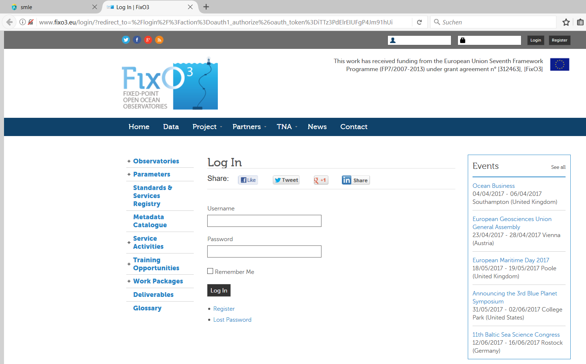*Login Popup for FixO3 Credentials*

After signing for the first time, you will have to authorize **SMLE**, allowing the application to access your **FixO3** account. E.g., the following figure shows the screen, where user "c.danowski@52north.org" may grant permission to **SMLE**:

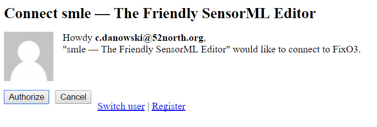*Login - Grant Permission to SMLE*

This step is not required for subsequent logins. When logged in, the **login** button is replaced by your **FixO3 account name** and the option to logout. In addition, the navigation bar is enriched with a new button called **Delete** allowing you to delete your sensor descriptions. Having logged in, all functionalities become available. Each is introduced subsequently within its own section.

Modifiable Items and Restrictions
---------------------------------

When logged in, you are able to *create*, *edit* or *delete* Sensor descriptions. ***However, you are only allowed to modify content that you have previously created by yourself!*** To be more precise, you are allowed to *view* any available sensor description from any user. Also you can *create* arbitrary new SensorML documents, providing a new unique identifier. But you are not permitted to *update* or *delete* sensor descriptions from another user. Only your own documents that are linked to your account are open for modification. Due to this restriction, the application prevents users to manipulate content without proper permission.

Although not being allowed to modify documents of other persons, the visual interface lets you edit an existing sensor description and even click on the **Publish** and **Update** buttons (see section [Edit your own SensorML Descriptions](#edit-your-own-sensorml-descriptions) for more detailed workflow). Only then **SMLE** will notice that you tried to change the description of another user and fail. This is due to technical reasons. As the underlying **SOS** instance stores, which sensor description was created by which user, **SMLE** builds and executes a **SOS** *UpdateSensorDescription* request. If the logged in user does not have the permission to update that specific sensor description, the **SOS** operation fails. As an enhancement, future version of **SMLE** might inspect earlier, whether users have permission to edit a certain document and inform them via suitable means (e.g. hide the edit button on a missing permission).

Create SensorML Document from Template
--------------------------------------

*You need to be logged in in order to publish a new SensorML description.*

### Find and Select Template

The application allows to create a new sensor description based on an existing template that already fills parts of the SensorML structure. Select **Create from Template** from the navigation bar to open a new menu where you can browse and search for available SensorML templates provided by the [ESONET YELLOW PAGES](http://www.esonetyellowpages.com/). As of March 2017 380 templates are available that can be filtered through appropriate keywords. To browse all templates, simply hit the **Search** button without any keyword. To filter the templates, enter any keyword and hit the **Search** button. The following example shows all entries for the keyword *salinity*.

*Create from Template - Filter Templates*

From the list of returned templates you may select the target template, which is used to create a new SensorML document. E.g. when selecting the template *Hydrolab Conductivity Sensor*, a description of the selected sensor as well as the option to **create a sensor description of this template** is provided. Optionally, you may already enter a new unique identifier for the new SensorML document, either manually or by clicking the **Create identifier** button, which generates a system-wide unique identifier. However, the identifier may be defined later as well.

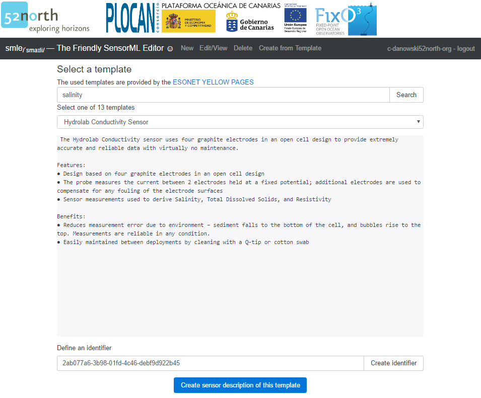*Create from Template - Select Template*

### Instantiate and Edit new SensorML Document based on selected Template

After selecting a template (and providing a new identifier) you may click on the button **Create sensor description from template**. This will instantiate a new SensorML document using the selected template to provide the necessary SensorML elements and insert predefined values. The application switches to the **edit view**, where the elements of the SensorML document are displayed. It allows to *add* new metadata within various elements of the sensor description or *edit* existing properties.

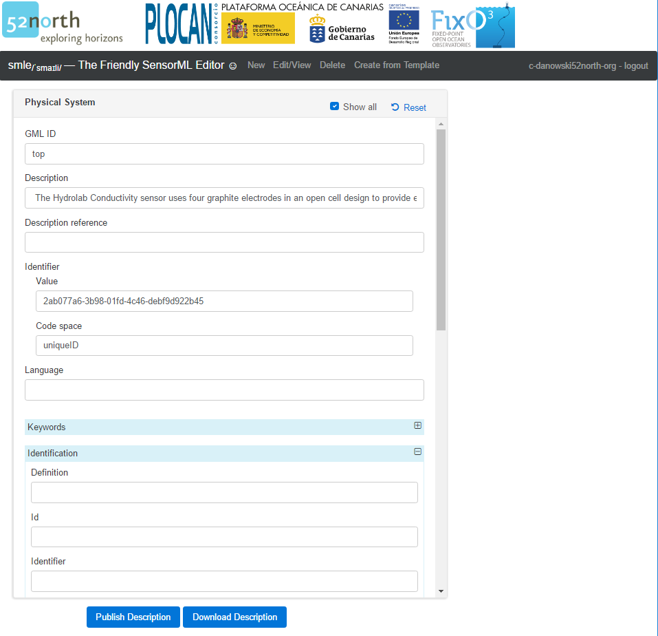*Create from Template - Instantiate Template*

The embedded frame characterizes the selected *Hydrolab Conductivity Sensor* as a **Physical System** offering appropriate editable properties for its sensor description. Other *description types / sensor types* are **Physical Component** and **Discovery Profile**, whose roles will be explained in section [Create new SensorML Document](#create-new-sensorml-documents). The **edit view** provides editable fields within the mentioned embedded frame. By default, some descriptive properties (such as the field ***Description***) are hidden from the user. To show all editable properties, you have to check the respective ***Show all*** field located at the top of the frame. Via the ***Reset*** button on its right, all manual edits can be reset to their initial state.

Concerning the editable fields, the embedded frame first contains an area with basic general properties such as ***GML ID*** or the ***Identifier***. If specified earlier, the ***Value*** property of ***Identifier*** stores the unique identifier, which can still be modified. Other thematically related properties are grouped by inner cyanish coloured collapsible elements. E.g. in the upper figure there are two collapsible sections visible, first the collapsed ***Keywords*** section and second the expanded ***Identification*** section. On expansion, they reveal editable properties.

The process of adding new information uses a nested window design to resemble the hierarchy of the added item. As an example, the subsequent series of figures shows how to add *contact information*. Notice how with each new hierarchy level a new nested window appears, where you can add/enter new information. To close a nested windows, you may either use the **Close** button on the top right of the window or click on the vertically oriented name of a previous hierarchy element on the left.

1.	Navigate to the **Contacts** collapsible of the SensorML document and expand it. Click on the **create element** button, which creates a new *Contacs* element. *Create from Template - Edit Properties - Click on 'create element' in 'Contacts' Section*

2.	The creation of the new **Contacts** element reveals a new **Add** button. Click it to *add* the next hierarchy level of the **Contacts** element, in this case the item *Responsible party*. 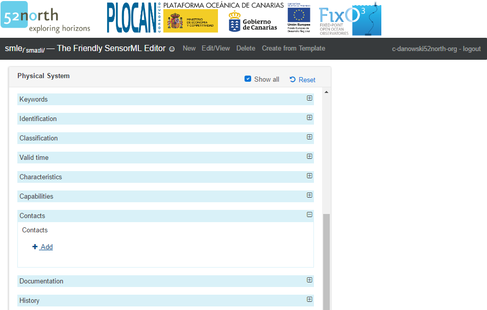*Create from Template - Edit Properties - Click on 'Add' in 'Contacts' Element*

3.	Click on **Responsible party** to open and edit it in a new nested window. 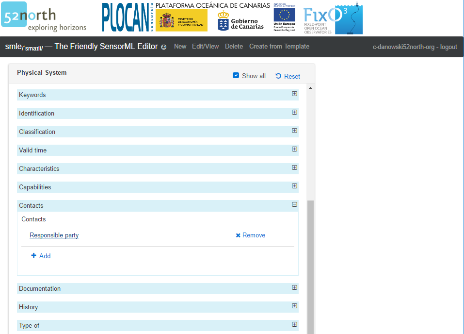*Create from Template - Edit Properties - Click on 'Responsible party'*

4.	Fill the form fields of the **Responsible party** element and, in addition, click on **Create Contact Info**, which adds a new item called *Contact Info*. Whenever you edit any form field, the corresponding content is immediately updated with the new value. Switching back to previous hierarchy level (in this case *Physical System* or *Contact List*) is allowed at any time. All changed values have been recognized and applied by **SMLE**. 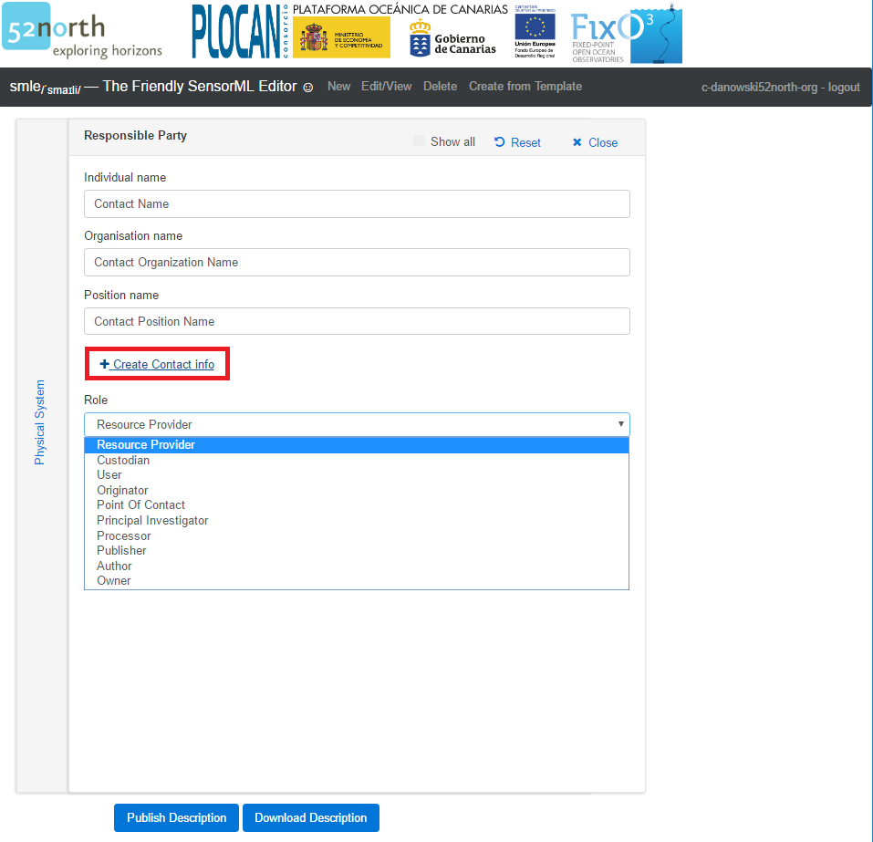*Create from Template - Edit Properties - Enter Values for 'Responsible party'*

5.	After creating a *Contact info* element click on it to open and edit its properties in a new nested window. *Create from Template - Edit Properties - Click on 'Contact info'*

6.	When you reach this point, you should have understood, how to edit the properties of a SensorML document using **SMLE**. Entries highlighted using *blue* colour reveal editable properties within a new nested window. Form fields represent the values of a certain property. E.g., within the depicted **Contact** element, there are three additional nested elements and two form fields to be edited. Within this guide only the **Address** element is configured subsequently. So click on it to open it as a new nested window. 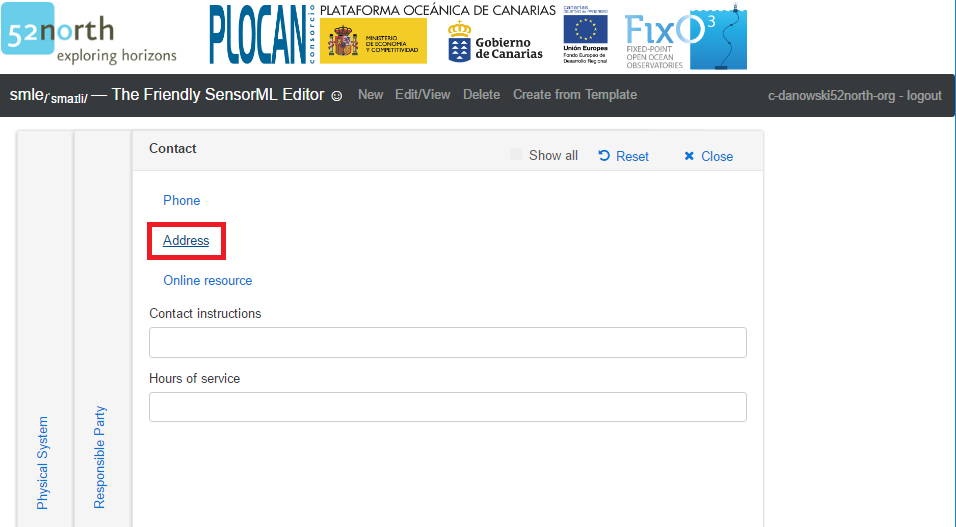*Create from Template - Edit Properties - Click on 'Address'*

7.	Fill out the form fields of the **Address** element with your values. Of particular interest are the fields **Delivery point** and **E-mail**. Both have additional interactions called *Add* and *Clear*. The *Clear* button clears the entered value while the *Add* button must be clicked to persist the entered value for the property. As these specific properties allow multiple values, it is not sufficient to only enter the new value within the form field. Instead you have to explicitly *add* it. *Create from Template - Edit Properties - Enter 'Address' Values*

8.	After explicitly adding the values of *Delivery point* and *E-mail*, you may enter a second value or remove any. The figure below shows that this guide defined one property for **Delivery Point** and two properties for **E-mail**. 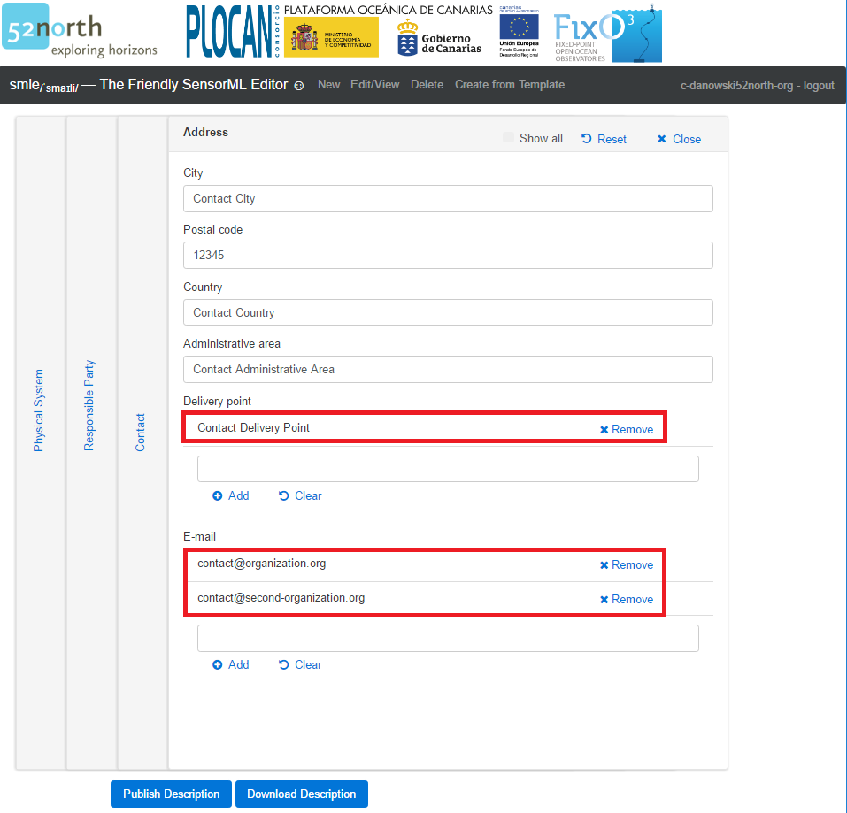*Create from Template - Edit Properties - Add 'Delivery Point' and 'E-Mail'*

9.	To finish editing the contact info you may either use the *Close* button within each nested window (located on the top right) or click on the vertically oriented name of a previous hierarchy level on the left. Using the latter, you may directly return to the leftmost window (in this case *Physical System*), which is the top-level of the SensorML Document.

At this point, you should have the knowledge to edit any property of the SensorML description. You may *add* new elements or *edit* the values of a existing elements in a nested window. Clicking on any item, which is highlighted using *blue* colour, will open that element as a new nested window to reflect the hierarchy of the SensorML document structure.

### Preset Structure and Values of the Template

As you may have noticed, when using a template certain elements are already pre-set with values from the template. While some values represent template-specific standard values that do not require changes (some values are even hidden from the user if the *Show all* checkmark is not checked, like the sensor **Description**), certain other elements are instantiated using ***null*** values. However, when relying on the template, you should have the knowledge to identify those elements and provide suitable values.

As an example, using the *Hydrolab Conductivity Sensor* template, the **Classifiers** element within the **Classification** section is pre-set with certain classifier properties. Open this element by expanding the **Classification** collapsible.

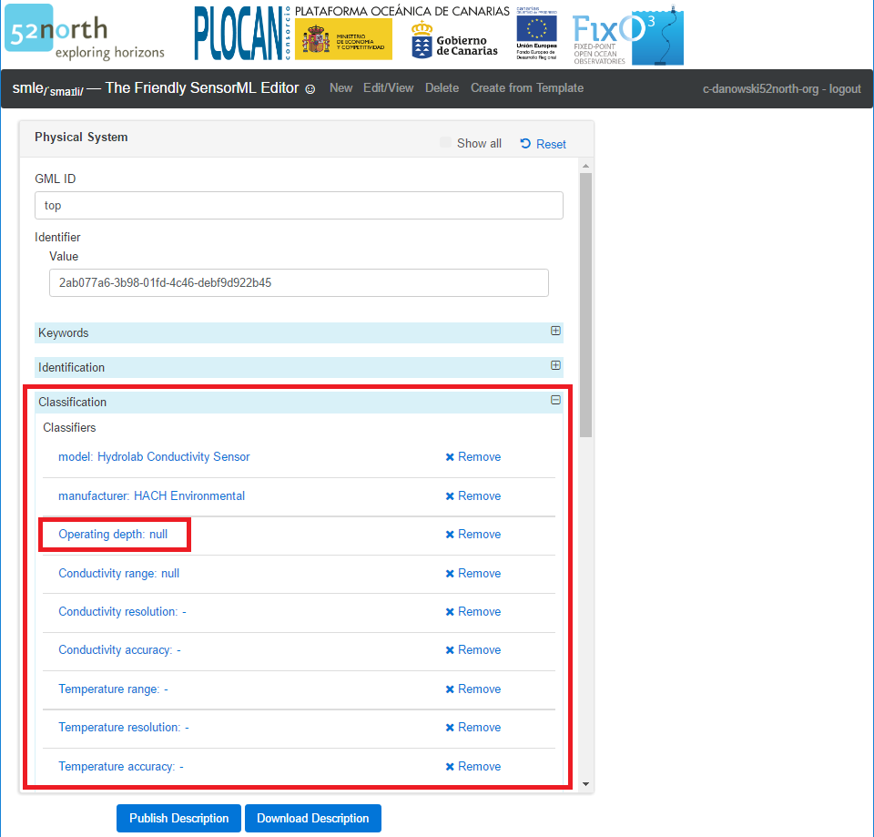*Create from Template - Edit Elements - Expand 'Classification' Section*

This will reveal a list of all pre-set **Classifiers** of the template. A **Classifier** comprises an *identifier/label* and a *value*. As you can see, the *value* of most of the **Classifiers** is set to **null** or **\-**. However, as they describe important operational characteristics of the chosen sensor, you should fill them with applicable real values. To replace/override any value, click on the corresponding item. E.g. click on **Operating depth** to open it in a new nested window called *Term*. Within it you might change the **Label** and in particular the **Value** of the displayed item. As soon as you replace the **Value** property, you may close the *Term* edit window.

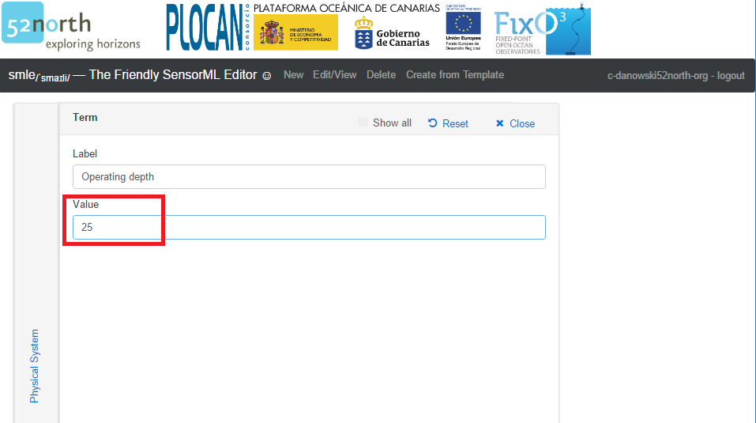*Create from Template - Edit Properties - Override Values set by Template - 1*

Back on the hierarchy level *Classifier list* you should verify that the edited property indeed carries the new value.

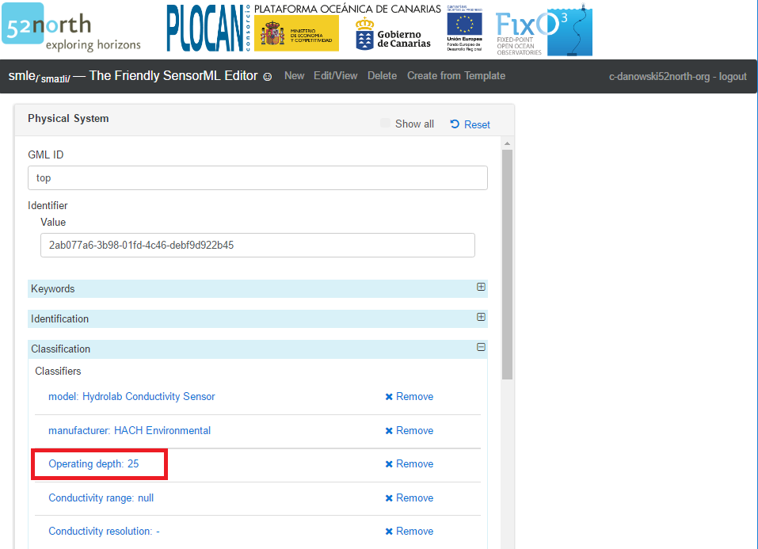*Create from Template - Edit Properties - Override Values set by Template - 2*

As shown by this simple example, you should navigate through all pre-set values and edit them to the de facto values of the sensor for which you create the SensorML document. **SMLE** will **NOT inform** you about any property that still carries any *null* values. So you will have to carefully inspect each property by yourself. Should you wish to remove any property, you are free to do so. Basing on a template is up to your choice and only provides recommendations on how to model sensor descriptions using the SensorML standard. In theory, you are free to include the necessary information about your sensor using other properties/elements of SensorML. However, using templates and its recommended pre-set properties allows better comparability to descriptions of similar sensors.

### Editable Sensor Characteristics

The following figure gives an overview of the main sections within a sensor description:

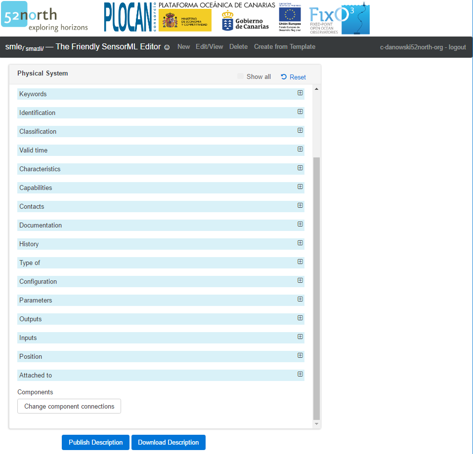*Editable Sections of a Physical Sensor*

This guide does not aim to give a detailed explanation of all SensorML components and which properties you can specifiy in each section. If you require information SensorML, please refer to the official [SensorML Specification of the OGC](http://www.opengeospatial.org/standards/sensorml).

As you can see in the upper figure, in addition to properties concerning the sensor itself (e.g. *Input* and *Output* definitions or *Configuration* details), you may also specifiy **connections/attachements** to other components. E.g. by clicking on ***Change component connections*** below, you may specify a connection to an already defined other sensor description via its *Identifier*.

### Publish and Persist new SensorML Document

Once the edit process of the sensor description has finished, you have two options to persist it. First you may *download* an XML file of the sensor description as SensorML document via the **Download Description** button. To publish the description wihtin the connected SOS-instance use the **Publish Description** button. Both are located below the edit window. Note that you have to be logged in to see the button!

*Actions for new Sensor Description*

Trying to publish your document, **SMLE** checks whether an *Identifier* has been specififed. If not, you are prompted to enter it now. Again, you may let the system generate a new identifier using the **Create identifier** button, as shown in the subsequent figure. Alternatively, enter a manual value.

*Create Identifier before Publishing (only prompted if Identifier was not specified earlier)*

When publishing the document, **SMLE** will provide you with a final uneditable view of the XML structure of the new SensorML document for verification purposes. Here you should proofread all the edited properties/elements. When detecting an error or some other reason to return to the edit view, use the **Edit Description** button located above the XML view. If you are satisifed with the preview of the new SensorML document, you find a notification below the XML preview. **SMLE** contacts the **SOS** instance to check, whether the *Identifier* of the new SensorML instance already exists within the **SOS**. If not, it informs you about this and offers you a button called **Add Description** to persist the created document within the **SOS**.

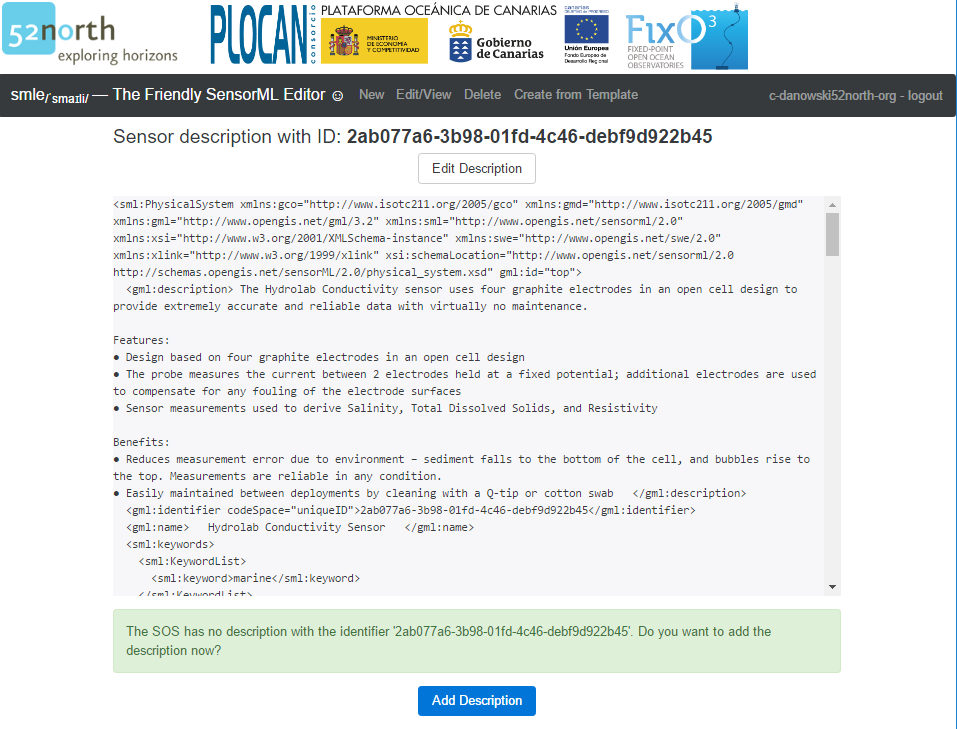*Publish Description*

After clicking the button, you are notified whether the process was successful. (e.g. note the success message at the bottom of the following figure. Occurring errors are described in sub-section [Error Handling](#error-handling) below.)

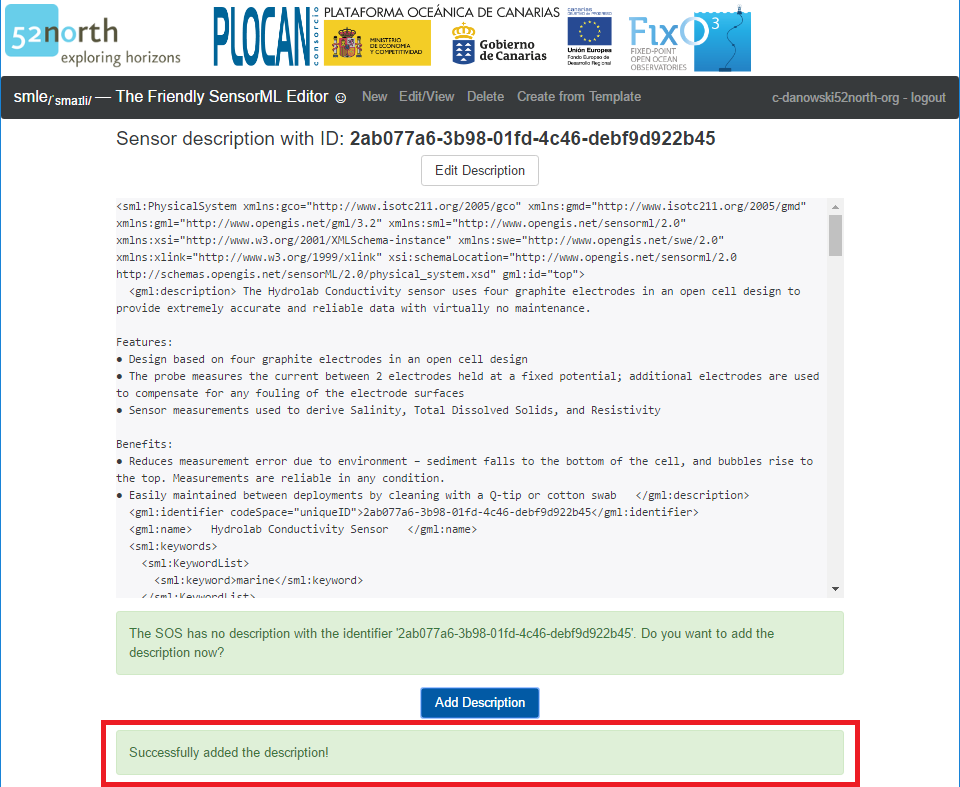*Publish Description - Success*

Should the *Identifier* already exist within the **SOS**, you are asked if you want to *update* the existing document using an **Update Description** button. Here you should carefully decide what to do. If you created a new SensoML instance for a new sensor, the *Identifier* should be new as well. If you receive a notification that the *Identifier* already exists, you should edit the document and alter the property.

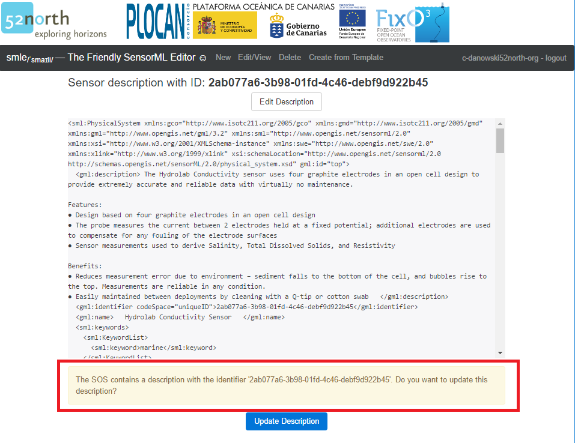*Publish - Update Description*

Once persisted within the **SOS**, you are still able to edit the document using the **Edit Description** button and re-publish the document. In this case the identifier should remain untouched to only *update* the existing document within the **SOS**.

### Error Handling

When trying to publish a SensorML document, the underlying **SOS** might respond with an error message in case the SensorML document does not conform to the requirements of the **SOS** and **SensorML** standards. An error message may have several reasons. To mention a few: - a needed element may not be specified - empty elements may not be allowed - provided property values do not pass validity checks.

If the **SOS** rejects the SensorML document for whatever reason, **SMLE** displays the error message at the bottom of the publish view, according to the next figure.

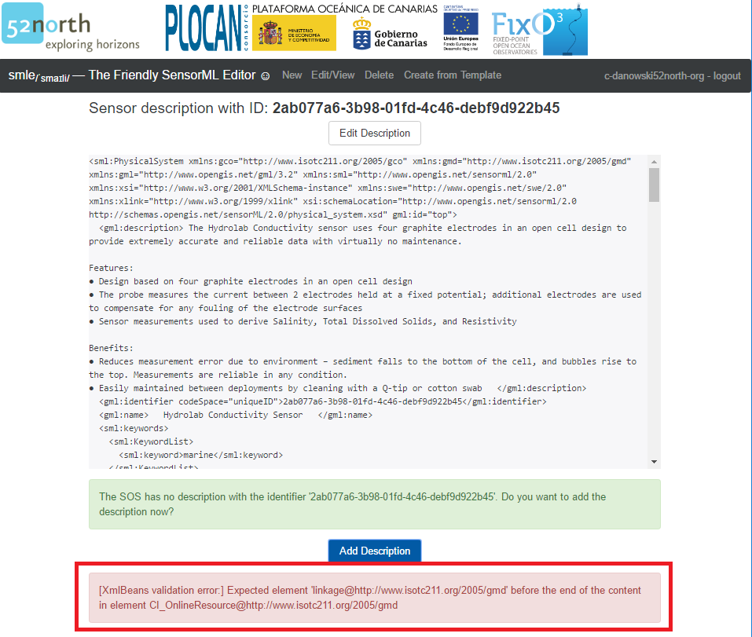*Publish - Add Description - Error Message from SOS Instance*

Currently, the displayed error message is forwarded from the **SOS** instance and should indicate what kind of error occurs. Hopefully, the message contains a hint on how to edit the SensorML document to make it valid. In this case the error message notifies you of a missing required element called *linkage* within the higher-level element *CI_OnlineResource*. Sadly, there is no indication on where to find the latter. To troubleshoot the problem in worst case scenario, edit the document and inspect every hierarchy level to find the required element and provide a proper value for it. For instance, the created *Contact* element defines an element **Online Resource** with the property **Linkage**. So, navigate to *Contacs - Responsible Party - Contact (Contact Info) - Online Resource* to enter a suitable value, as shown in the following figure.

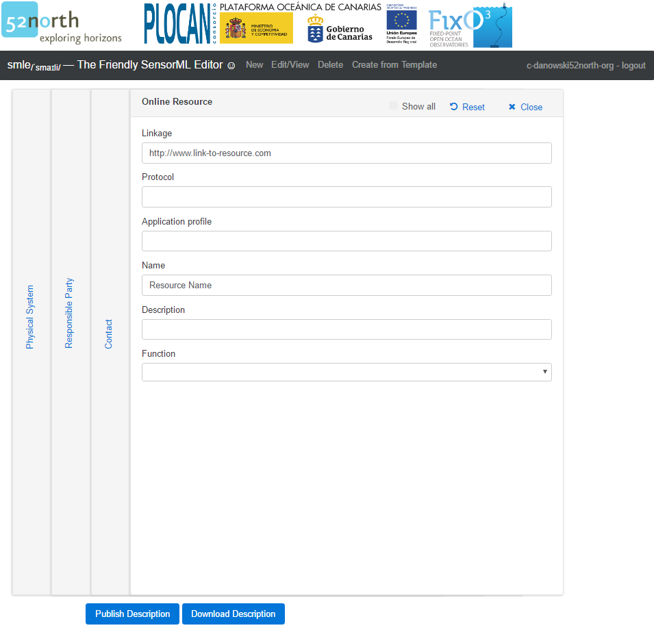*Enter required Information to eliminate Error and try to Publish the Description again*

After that hit the **Publish Description** button again to open the publish view and add/update the new sensor description. If no other error occurs, the **SOS** will then save the transmitted document.

Create new SensorML Documents
-----------------------------

*You need to be logged in in order to publish a new SensorML description.*

In contrast to creating a new SensorML instance using a template, you are free to create a completely new document via the menu **New** from the navigation bar. As first step you are prompted to choose the *descriptionType* of the new document instance. Currently you can choose between *PhysicalSystem* for single sensor devices, *PhysicalComponent* for sensor components within a multisensor component-based setting and *DiscoveryProfile*. While the first two allow the definition of SensorML sensor descriptions in an arbitrary way (without many restrictions on elements and properties), the latter option *DiscoveryProfile* conforms to the [SensorML Profile for Discovery](http://portal.opengeospatial.org/files/?artifact_id=33284) as specified by the OGC. Its purpose is to apply a variety of restrictions regarding the existance and value ranges of SensorML elements and properties in the context of *discovery and harvesting services and mechanisms*. For this reason, the ***Discovery Profile*** declares mandatory elements as well as a prescribed structure of sensor descriptions.

```
***TODO*** how does SMLE manage DiscoveryProfile descriptions. Doe it give hints to the user regharding missing elements or falsely entered values?
```

*Create New Description - Select Description Type*

After selection you enter the *edit view*, where you can add necessary sensor information using dedicated elements and properties of the SensorML standard. The process of adding/editing information as well as the process of publishing the document has already been described in the previous section [Create SensorML Document from Template](#create-sensorml-document-from-template). Thus, it is skipped here.

For instance, choosing the *descriptionType* **PhysicalComponent**, the following **edit view** opens.

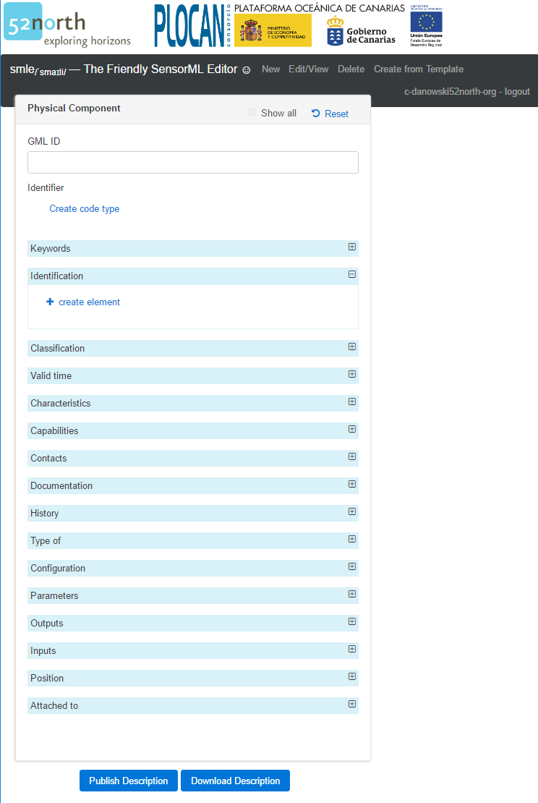*Create New Description - Edit new empty Description*

As you notice, the created document is still empty, as you start editing from the scratch. Whether you decide to edit an empty description or base on an existing template is up to you. However, it is recommended to start using a template, if possible. The pre-set structure generated by the template may allow better comparability between similar SensorML documents of similar sensor settings.

View existing SensorML Descriptions
-----------------------------------

To view existing sensor descriptions, you do not have to be logged in. Navigate to the menu **Edit/View** from the navigation bar to find a dropdown with the available SensorML documents.

*View Description - Select SensorML Document*

After selecting a certain document, **SMLE** provides you with a collapsed tree structure of the elements of the SensorML document, as shown in the subsequent figure. Each element of the description can be expanded to inspect its hierarchy and properties.

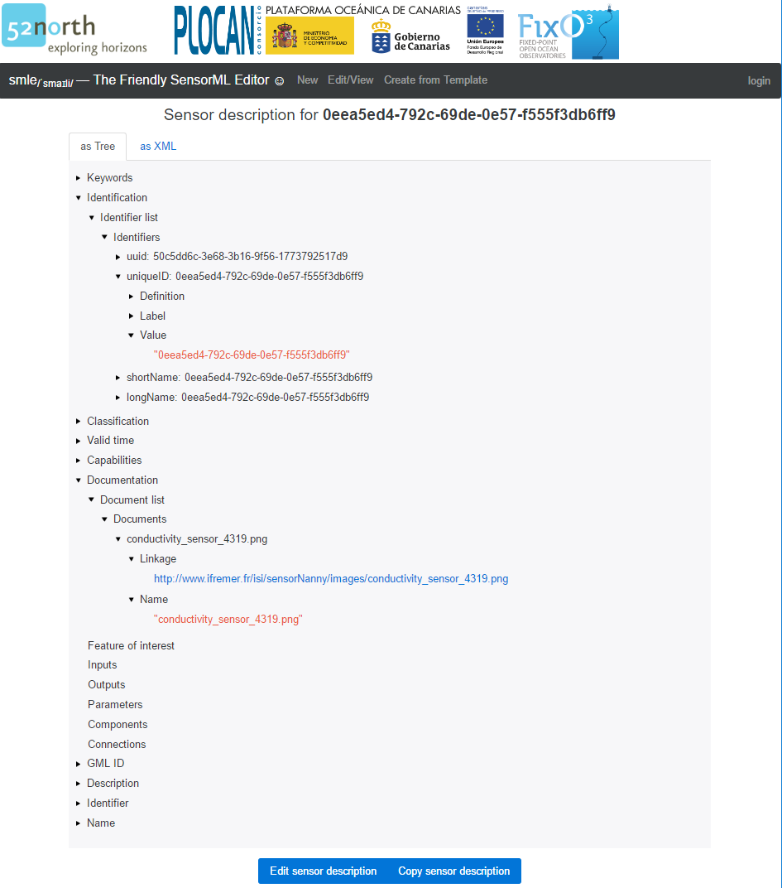*View Description - As Tree Structure*

You can inspect each element with a leading horizontal arrow by clicking on it to reveal the next hierarchical element. Leaf node values are marked using orange colour and surrounding quotes while attribute values are marked using blue colour. Alternatively, the XML equivalent of the SensorML document can be viewed by switching to the **as XML** tab.

*View Description - As XML Structure*

Below both views you find two buttons **Edit sensor description** and **Copy sensor description**. While the former allows you to edit the existing document (as identified by its unique ID) the latter creates a copy of the currently selected SensorML instance but removes its *unique identifier*, causing you to provide a new *identifier* within the edit view. Note that although you might not be logged in, you still see both buttons allowing you to switch to the corresponding views.

Edit your own SensorML Descriptions
-----------------------------------

*You need to be logged in in order to edit an existing SensorML description. Also you are only allowed to edit sensor descriptions that you have created with your account.*

To edit a previously created SensorML document, click on the menu **Edit/View** from the navigation bar and select the **id** of the document you intend to edit. This will provide you with the view window as already described in the previous section. To edit the document click on **Edit sensor description**, which opens the edit view, where all stored information of the selected document is displayed. Here you can apply changes like add missing information or override/remove existing elements/properties. The process of editing has already been described in section [Create SensorML Document from Template](#create-sensorml-document-from-template) and is skipped here. Please refer to that section for details. After editing you can re-publish the document by updating the document using the same *identifier*.

### Role of the unique Identifier

Each stored SensorML document stored in the **SOS** is referenced by its unique *identifier*. When you intend to only update an existing sensor description, it is vital that you leave the *identifier* untouched. When you change it and then publish the document, you will create a whole new additional document, under the assumption that the new identifier does not exist yet. In a worse case the modified identifier references a different existing SensorML instance dscribing a different sensor. As a consequence, you should always carefully check the *identifier* property and associated notification messages of **SMLE** to prevent false publishing of a document.

### Restriction to only edit your own Content

You are enabled to view and edit any available SensorML document of the underlying **SOS**. However, when trying to re-publish/update a modified SensorML document, which is not linked to your account, **SMLE** will inform you that you miss the appropriate permission, as the underlying **SOS** rejects the update from the non-authorized user.


As a result, you are only allowed to update sensor descriptions that you have created with your current account. To still save the modifications of a certain sensor description, for which you do not have the sufficient permission, you might change its *identifier* and thus create an additional sensor description. Mind that this process preserves the *old* sensor description and creates a modified *new* version using a different *identifier*. Whether this approach is applicable is up to you and your working environment.

Delete your own SensorML Descriptions
-------------------------------------

*You need to be logged in in order to delete a SensorML description. Also you are only allowed to delete sensor descriptions that you have created with your account.*

To delete a previously created sensor description navigate to menu **Delete**. Note that this menu is only available after successful login. Within the delete view, you choose the desired document via a dropdown list.


After selection you see the XML structure of the selected document. Inspect it to verify that this is the desired document, which should be deleted. By clicking the **Delete sensor description** button, you will irretrievably delete the document! **SMLE** will not prompt you with an additional conformation request.


As a result, the document is deleted from the underlying **SOS** and **SMLE** displays a success message.


### Restriction to only delete your own Content

Similar to the restriction of editing your own content, you are also only authorized to delete any SensorML document that is linked to your current account. You are not allowed to delete the descriptions of another user.
